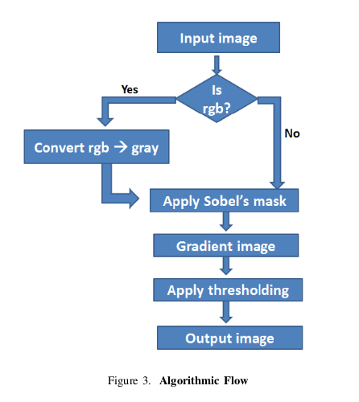
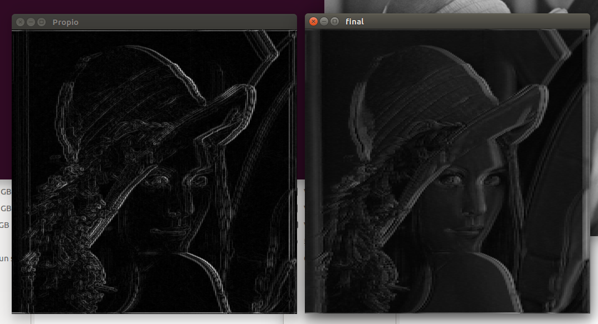

# Topicos_Grafica
#### Alumno: Condori Mamani Christian Erik.
### PAPER.
El trabajo se baso en el paper "PARALLEL EDGE DETECTION BY SOBEL ALGORITHM USING CUDA C". 
Consiste en hallar los borde de una imagen, para esto se uso el metodo de SOBEL que usa una mascar (Matriz 3x3) para realizar el calculo a cada pixel, la mutiplicacion se da entre la mascara (Matriz 3x3) con el pixel seleccionado y sus vecinos.
### FLUJO DEL ALGORITMO.
La siguiente figura muestra el flujo del algoritmo que se siguio para el calculo.

### SOBEL.
El metodo de SOBEL para hallar bordes ya esta implementado en la libreria OpenCV, se hizo una comparacion entre el metodo implementado(final) y el metodo ya implementado en OpenCV(propio). 

se nota una diferencia por el hecho de que en una imagen se utilizo Blur Gaussiano que mejora la imagen y el calculo.

### RESULTADOS con GPU.
No se calcularon resultados, pero se espera una notoria mejoria por el hecho de que una imagen es representada por una matriz de INT, Si llevamos esta matriz a GPU el procesamiento sera mas rapido para imagenes grandes. Si se trabaja con imagenes pequeñas el resultado del tiempo de ejecucion podria ser mayor que el calculo serial, esto se da por que al pasar la matriz de HOST a DEVICE se realiza una copia valor por valor, esta copia influye en el tiempo de ejecucion del algoritmo en GPU.
